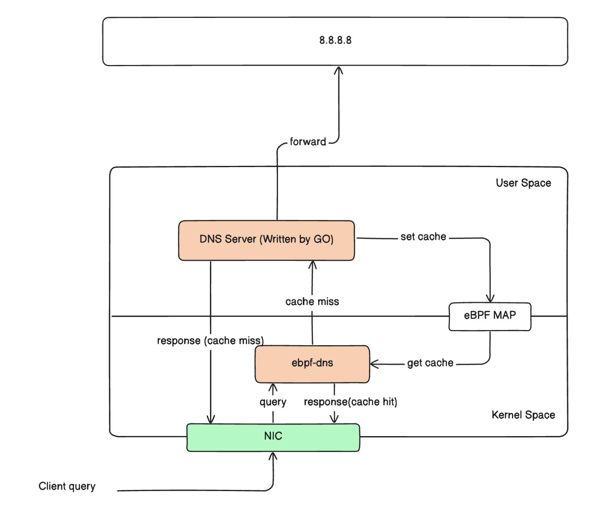

# ebpf-dns
eBPF backend DNS cache server

## Dependencies

* Linux kernel version 5.7 or later 
* Go 1.22.4
* [ebpf-go](https://ebpf-go.dev/) v0.15.0

## Compile

First, install the Go dependency package in the current directory.

> go get

### Compile all

> make all

Compile eBPF byte code and build go user space program, generate ebpf_dns.o and ebpf_dns executable file.

### Compile eBPF bytecode

> make 

Compile eBPF byte code, support  `make debug`, output more detaild ebpf logs.

### Compile go program

> make go

You can also run go build to directly generate a binary executable file in the current directory.

## Run

>sudo ./ebpf_dns

Running `./ebpf_dns`, the program mainly does two things:

1. **Runs a user-space program**. The user-space program listens on the local machine's port 53, receiving DNS requests from clients. It then forwards these requests to upstream recursive servers to obtain DNS response content. While returning the DNS response to the client, it simultaneously caches the results for A, AAAA, and CNAME requests in the eBPF MAP.
2. **Loads the XDP program into the kernel**. The kernel program monitors DNS traffic. If it's an A, AAAA, or CNAME type request, it queries the eBPF MAP to check for cached records. If a cached record exists, it directly uses the cached result to construct a response packet and sends it back to the client using XDP_TX. This entire response process is completed within the kernel, without reaching the upstream user-space program, achieving high-performance queries. If there's no cached record in the eBPF MAP, it returns XDP_PASS, handing the request over to the upstream user-space program for processing.

## Debug

User space program will output log to stdout directly. The logs of the kernel eBPF program can be viewed using the following command:

> sudo cat /sys/kernel/debug/tracing/trace_pipe
